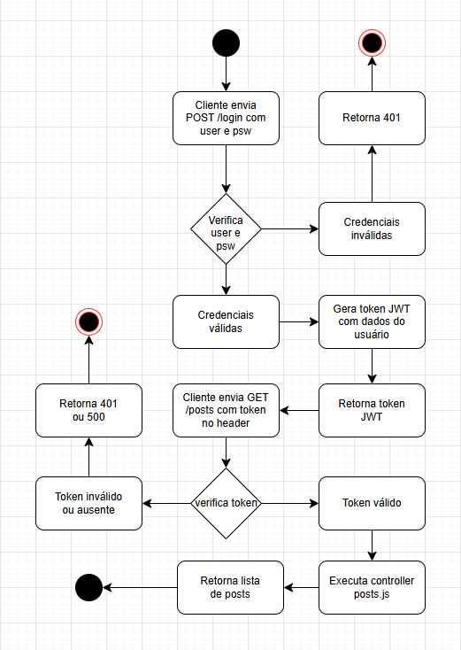

# Login - auth
Estrutura de autenticação para o projeto **Login**.
## Atividade em grupo de até 3 integrantes.
- Clonar este repositório.
- Testar a api com **insomnia**.
- Estudar e documentar a estrutura do projeto.
- Detalhar e documentar as bibliotecas utilizadas.
- Documentar descrição do funcionamento utilizando **UML DA(Diagrama de Atividades)**.


# 🧠 API de Autenticação e Posts

Este projeto é uma API simples feita com **Node.js** e **Express**, que possui autenticação JWT e uma rota protegida para exibir posts. O projeto foi testado via **Insomnia** e está funcionando corretamente.

---

## 📁 Estrutura do Projeto

├── node_modules/

├── src/

│ ├── controllers/

│ │ ├── login.js

│ │ └── posts.js

│ ├── data/

│ │ └── posts.js

│ ├── middlewares/

│ │ └── auth.js

│ └── routes/

│   ├── login.js

│   └── posts.js

├── .env

├── package-lock.json

├── package.json

└── server.js

---

## 📦 Bibliotecas Utilizadas

| Biblioteca       | Descrição |
|------------------|-----------|
| `express`        | Framework web para criar rotas HTTP |
| `jsonwebtoken`   | Utilizado para gerar e validar tokens JWT |
| `dotenv`         | Carrega variáveis de ambiente a partir do `.env` |
| `crypto` (nativo)| Usado para gerar ID aleatório no token |

---

## 🔐 Autenticação JWT

- A rota `/login` gera um token válido por 2 minutos.
- A rota `/posts` é protegida por middleware e exige token válido via header:

Authorization: Bearer <token>

---

## 🔐 Autenticação JWT
- A rota **/login** gera um token JWT válido por 2 minutos.

- A rota **/posts** é protegida: só pode ser acessada se o token válido for enviado no cabeçalho:

```
Authorization: Bearer <token>
```

## 🔁 Rotas da API
### 📨 POST /login
- Descrição: Autentica um usuário fixo e retorna um token JWT.

- Requisição (Body JSON):
```
{
  "user": "usuario@gmail.com",
  "psw": "a1b2@b3c4"
}
```
- Resposta (200 OK):
```
{
  "token": "<JWT gerado>"
}
```
🔒 GET /posts
- Descrição: Retorna uma lista de posts.
 - ⚠️ Necessita token válido no header.

- Cabeçalho (Header):

```
Authorization: Bearer <token>
```
- Resposta (200 OK):
```
[
  {
    "id": 1,
    "title": "Como ser mais produtivo em 2025",
    "summary": "Dicas práticas para organizar sua rotina e alcançar mais resultados.",
    "date": "2025-05-10",
    "views": 1243,
    "likes": 210
  },
  ...
]
```

### ✅ Testes realizados (via Insomnia)
- ✔️ Login com credenciais corretas gera token válido

- ✔️ Token válido acessa rota protegida /posts

- ❌ Sem token ou token expirado bloqueia acesso

---

## Diagrama




### Integrantes do grupo:

- Hélio Alves de Oliveira

- Diego Maradona Preti Costa Figuerêdo

- Arthur Souza de Oliveira
